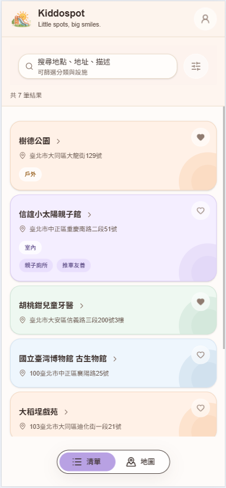
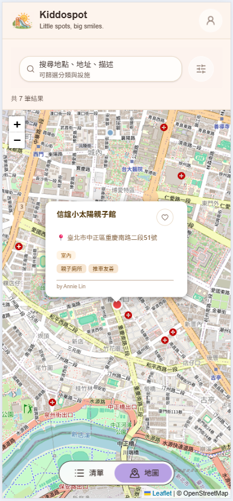
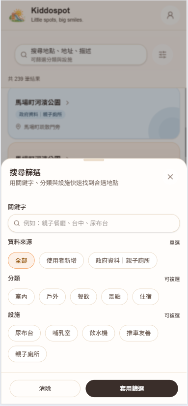
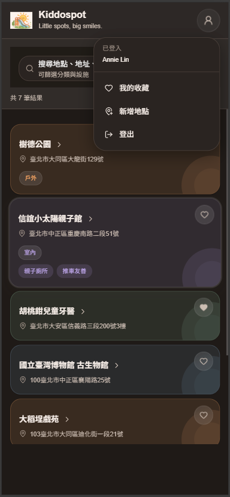

# 🌈 Kiddospot — 親子友善地點探索平台

Kiddospot 是一個專為家長設計的「親子友善地點探索網站」，  
透過地圖與清單的結合，幫助使用者快速找到適合帶孩子前往的場所。

👉 Demo: https://www.kiddo-spot.com/  

---

## 🧠 專案背景

在日常生活中，家長常需要花時間搜尋「適合帶小孩去的地方」，  
例如：是否有尿布台？是否親子友善？是否有遊戲空間？

Kiddospot 的目標是：

- 提供一個「可搜尋、可篩選」的親子地點平台
- 結合地圖與 UI，提升探索效率與體驗
- 建立一個可持續擴展的資料與互動系統

---

## ⚙️ 技術架構

### Frontend
- Next.js (App Router)
- React + TypeScript
- Tailwind CSS v4（自訂 design system）
- SWR（資料請求與快取）
- React Leaflet（地圖功能）

### Backend
- Next.js API Routes
- Prisma ORM
- PostgreSQL（Supabase）

### Authentication
- NextAuth.js（Google OAuth）

### Deployment
- Vercel（前端部署）
- Supabase（資料庫）

---

## ✨ 核心功能

### 🔍 搜尋與篩選
- 關鍵字搜尋（名稱 / 地址 / 描述）
- 多選分類（tags）
- 多選設施（facilities）
- URL query 同步狀態（支援分享與重整）
- 支援「資料來源」進階篩選（使用者 / 政府資料）

---

### 🌐 外部資料整合（政府開放資料）
- 整合政府開放資料（親子廁所點位）
- 支援 CSV（Big5）資料匯入與解析
- 自建 ETL script（資料清洗 → DB）
- 自動轉換為系統內統一資料格式（ExternalPlace）
- 與既有地點資料合併顯示（List / Map）

---

### 🗺 地圖 / 清單雙視圖
- List / Map 切換
- 點擊清單 → 地圖自動 flyTo
- Marker hover / selected 狀態同步
- 地圖與 UI 互動整合

---

### ❤️ 收藏系統
- 使用者登入後可收藏地點
- optimistic UI（即時更新）
- 與使用者資料關聯

---

### ➕ 新增地點
- 表單 + Bottom Sheet UI
- 地圖點擊自動填入經緯度
- 多選 tags / facilities
- 與使用者帳號關聯（createdBy）

---

### 🎛 搜尋體驗設計
- Bottom Sheet 篩選 UI（類 App 體驗）
- active filter 顯示（chips）
- 即時統計結果數量
- 清除 / 套用分離操作

---

### 🎨 UI / UX 設計
- 自製 Design System（Tailwind + CSS variables）
- 支援 Dark Mode
- 卡片式 UI（多主題配色）
- 一致的 Button / Input / Chip 設計
- Portal + z-index 管理 modal / sheet

---

## 🧱 資料模型（簡化）

- Place（使用者建立）
- ExternalPlace（政府資料）：ExternalPlace 用於承接外部資料來源，並透過統一 schema 與 UI 呈現整合至主系統。
- Tag（分類）
- Facility（設施）
- ExternalFacility（外部設施）
- Favorite（收藏）
- User（使用者）

多對多關聯：
- Place ↔ Tag
- Place ↔ Facility

---

## 🧩 系統設計重點

### 1. 前後端分離（API 驅動）
- 前端透過 `/api/places` 等 API 取得資料
- 篩選條件透過 query 傳遞
- 統一資料格式與回傳結構

---

### 2. URL State 管理
- 搜尋與篩選條件同步到 URL
- 支援分享連結與重整後還原狀態
- 與 SWR 搭配實現資料重新請求

---

### 3. Design System 建立
- 使用 CSS Variables + Tailwind 建立主題
- 抽象 `ui.ts` 作為共用樣式
- 支援 light / dark mode 一致風格

---

### 4. 地圖與 UI 整合
- Marker 與 List hover / selected 同步
- Map → List / List → Map 雙向互動
- 自訂 Marker（顏色、狀態）

---

### 5. 使用者體驗優化
- optimistic UI（收藏）
- loading / empty state 設計
- bottom sheet（行動裝置體驗）

---

### 6. 多資料來源整合（Data Integration Layer）
- 建立 ExternalPlace schema，隔離外部資料與內部資料
- 透過 script（CSV → DB）實作資料 ETL 流程
- 使用名稱對齊（facility name mapping）解決跨表 ID 不一致問題
- 在前端 merge 多來源資料，保持 UI 一致性

---

## 🚧 未來規劃

- ⭐ 評分與評論系統
- 📝 使用者回報 / 分享
- 🔐 更完整的權限管理（RBAC）
- 📊 熱門地點 / 推薦機制
- 🧭 地圖範圍搜尋（viewport query）
- 📱 PWA / 行動裝置優化
- 🎯 篩選條件儲存（個人偏好）
- 🗺 Map marker clustering（大量點位優化）

---

## 🙋‍♀️ 關於我

本專案為個人 Side Project，  
由前端工程師自行設計並實作前後端。

在此專案中，我嘗試：

- 從 0 建立完整產品（UI / API / DB）
- 練習全端開發能力
- 設計可維護的架構與 UI 系統
- 強化使用者體驗與互動細節

---

## 📌 技術學習重點

- Next.js App Router 實務應用
- Prisma + PostgreSQL schema 設計
- NextAuth 身份驗證流程
- SWR 資料同步策略
- Tailwind + Design System 建立
- 地圖互動（React Leaflet）

---

## 📷 畫面截圖


- 首頁 list view

- map view

- filter sheet

- dark-mode


---

## 🛠 安裝與啟動

```bash
npm install
npm run dev